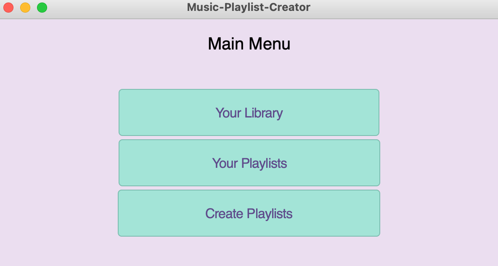
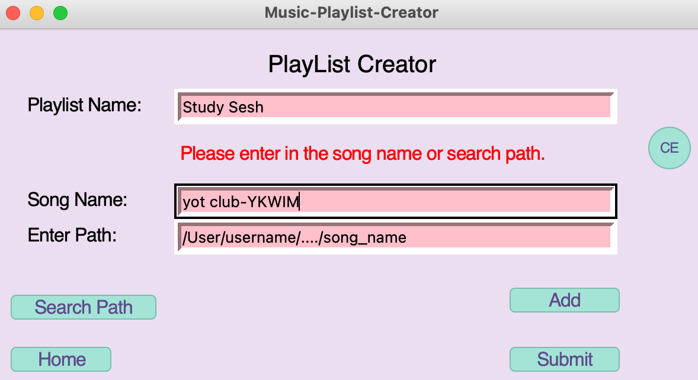
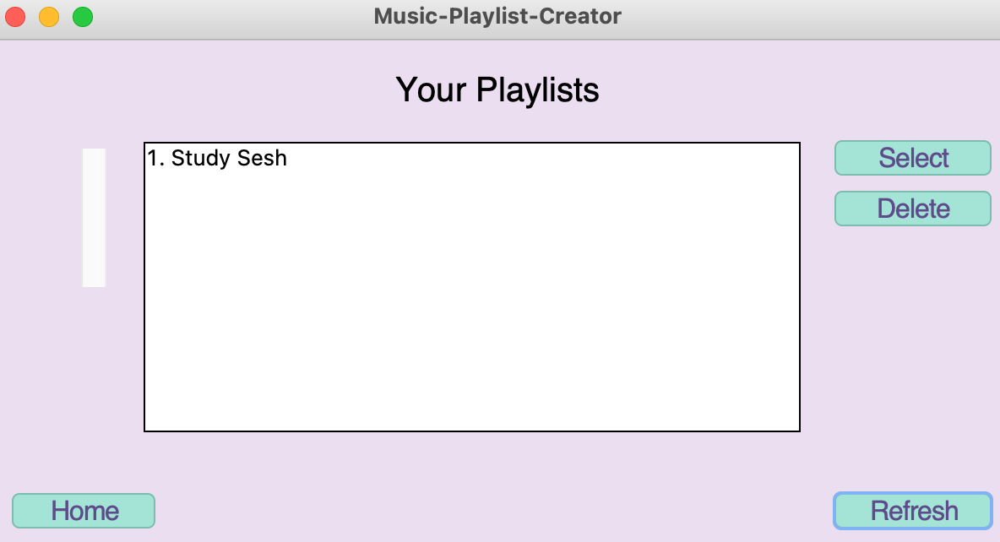
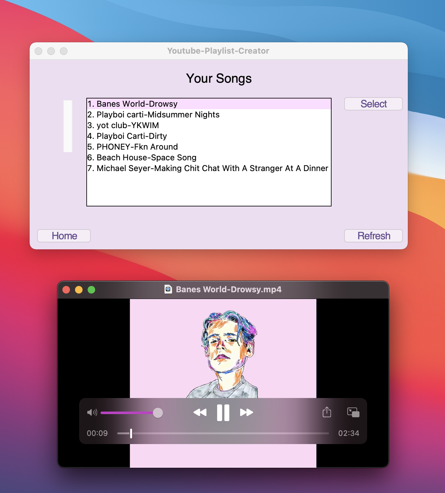
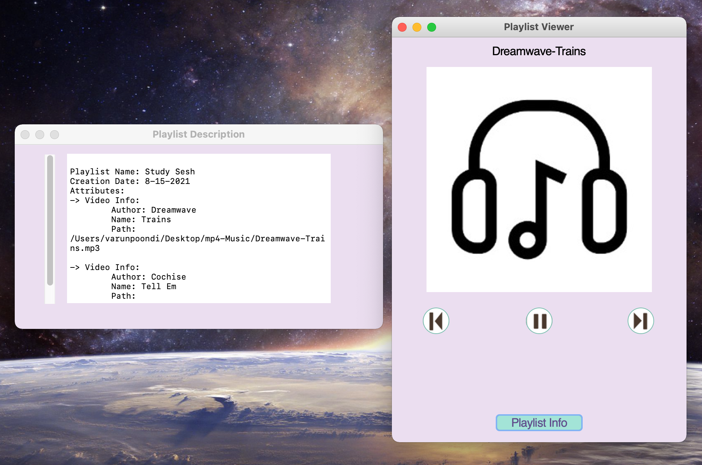

# Music-Playlist-Creator🎷🎸🎶🎵

## General Info:
* I want to develop a simple playlist creator with an easy to use mp4 and mp3 file manager. 
  Users are able to brows individual songs and playlists by checking their libraries. Users have the ability to delete from libraries or from local machines. 
  Users are able to only create playlists if they are mp3 files however mp4 and mp3 can both be viewed in song library. This playlist creator is very easy to use and canhelp users organize their audio files into one simple program.

## Features:
* Expandable song and playlist library
  * Able to add songs that are currently stored in library or found in local machine

* Expandable libraries for both songs and playlists with option to delete selected items from libraries and/or local machine
* User-friendly playlist creator interface
* Playlist summary feature for file management analysis
* Simple playlist viewer interface with pause, next, and previous buttons
  
### Prospective Features:
  * Dynamic Song movement
  * mp4 playlist compatibility 
  * Create check to see if users are formatting song titles correctly (Author-Song_Name)
  * Create song status bar to forward through song

## Main Python Libraries Used
* tkinter
* tkmacos
* sqlite3
* pygame

## Notice:
* Developed for MacOS.
* Requires Python 3

## Sample Images

