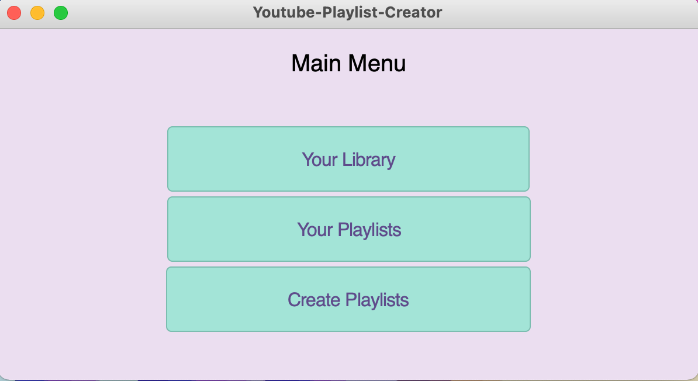
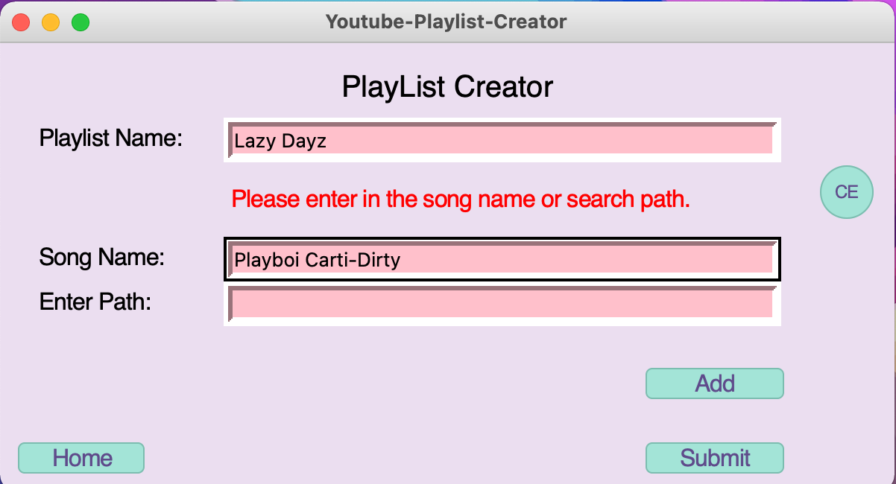

# Music-Playlist-Creator🎷🎸🎶🎵
## A simple playlist creator 
## Motivation:
* I have been downloading mp4 videos from youtube for a while, and I felt that it was annoying to go through my computer to select and organize them. I decieded to work on a project that used python to create mp4/mp3 playlist creator. This project gives users the ability to easilty organize their personal songs and videos and allows them to create simple playlists.
## Features: 
### Version: 1.0.0
* Expandable song and playlist library
  * Able to add songs that are currently stored in library or found in local machine
* Song and playlist search engines using sqlite3 database
* Songs and playlists can be deleted from librarys and/or local machine
## Main Python Libraries Used
* tkinter
* tkmacos
* sqlite3
## Notice:
* Developed for MacOS.
## Sample Images

